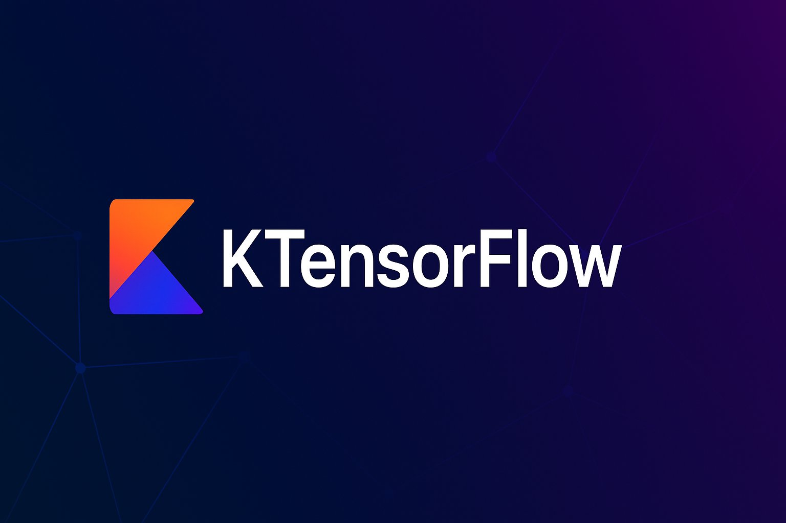

[](https://repo1.maven.org/maven2/dev/kursor/ktensorflow/ktensorflow-core/)
[](http://www.apache.org/licenses/LICENSE-2.0)

# KTensorFlow
KTensorFlow is a Kotlin Multiplatform library designed to run LiteRT (TensorFlow Lite) neural network models from common code. It abstracts platform-specific implementation details, making it easier to load models and run inference across Android and iOS.

## Table of Contents

- [Installation](#installation)
- [Usage](#usage)
  - [Loading of the model](#load-the-model)
    - [Moko resources extensions](#moko-resources-extensions)
  - [Run inference](#run-inference)
    - [Data transformation with Tensors](#data-transformation-with-tensors)
  - [Hardware acceleration](#hardware-acceleration)
  - [Providing platform-specific options](#providing-platform-specific-options)
  - [Writing custom delegates](#writing-custom-delegates)
  - [Preprocessing and postprocessing of the data](#preprocessing-and-postprocessing-of-the-data)

## Installation
First add dependencies:

```kotlin
dependencies {
  // core module, contains Interpreter and other core classes and functions
  implementation("dev.kursor.ktensorflow:ktensorflow-core:1.0")

  // tensors module, adds support for Tensors and allows easy data transformation
  // highly recommended if you don't want to convert your model inputs and outputs to and from ByteArray
  implementation("dev.kursor.ktensorflow:ktensorflow-tensor:1.0")

  // gpu module, contains delegate to run inference on the gpu
  implementation("dev.kursor.ktensorflow:ktensorflow-gpu:1.0")

  // pipeline module, contains utils to create pipelines for preprocessing and postprocessing of the data
  implementation("dev.kursor.ktensorflow:ktensorflow-pipeline:1.0")

  // moko module, contains extensions for loading models from moko-resources (ModelDesc.FileResource and ModelDesc.AssetResource)
  implementation("dev.kursor.ktensorflow:ktensorflow-moko:1.0")
}
```

To link TensorFlow Lite binaries to iOS you need to add Linking plugin
```kotlin
plugins {
  id("dev.kursor.ktensorflow.link") version "0.3"
}
```
**Currently, this library only supports projects, that are being linked to iOS app via CocoaPods**

## Usage
### Load the model
First, you need to create `ModelDesc`, that would provide model to the library. 
`ModelDesc` needs to be created in platform-specific code, since Android and iOS have different ways of loading the model.

Android examples with Compose Multiplatform Resources:
* ModelDesc.File
```kotlin
val bytes = Res.readBytes("files/model.tflite")
val tmpFile = File.createTempFile("prefix", "suffix", context.cacheDir)
tmpFile.writeBytes(bytes)
val modelDesc = ModelDesc.File(tmpFile)
```

* ModelDesc.ByteBuffer
```kotlin
val bytes = Res.readBytes("files/model.tflite")
val byteBuffer = ByteBuffer.wrap(bytes).apply { order(ByteOrder.nativeOrder()) }
val modelDesc = ModelDesc.ByteBuffer(byteBuffer)
```

iOS examples with Compose Multiplatform Resources:
* ModelDesc.PathInBundle
```kotlin
val modelDesc = ModelDesc.PathInBundle(Res.getUri("files/model.tflite").removePrefix("file://"))
```

#### Moko resources extensions

Module `ktensorflow-moko` contains useful extension functions to create a `ModelDesc` from [moko-resources](https://github.com/icerockdev/moko-resources).

It adds 2 useful functions:
* `ModelDesc.FileResource(resource: FileResource)` to load a model from moko's `FileResource`
* `ModelDesc.AssetResource(resource: AssetResource)` to load a model from moko's `AssetResource`

### Run inference
To run the inference, create `Interpreter`:
```kotlin
val interpreter = Interpreter(
  modelDesc = modelDesc,
  options = InterpreterOptions()
)
```

Then run the model:
```kotlin
val inputArray = Array(28) {
  FloatArray(28) {
    Random.nextFloat()
  }
}
val input = Tensor(inputArray)
val output = Tensor(
  shape = TensorShape(10),
  dataType = TensorDataType.Float32
)
interpreter.run(input, output)
val result = output.argmax()[0]
```

**Note**

`Tensor` class stores data in a ByteArray. So, if you're using `Tensor(any: Any)` to create a Tensor from multidimensional primitive array, it copies entire array inside a new ByteArray.
Because of this, it is better to use `Tensor(shape: TensorShape, dataType: TensorDataType)` for output tensors, 
since it will allow to skip copying of the array and just allocate a ByteArray of the necessary size. It will allocate ByteArray of the size `shape.flatSize * dataType.byteSize`, with data type memory size already taken into account.

#### Data transformation with Tensors
Tensors support arithmetic, and transformation operations, as well as `forEach`, `sum`, `min`, `max`, `argmin`, `argmax` functions

### Hardware acceleration
Hardware acceleration is provided by delegates. `ktensorflow-gpu` module already has `GpuDelegate` implementation to run the inference on GPU.

Delegates can be provided to interpreter using `InterpreterOptions`
```kotlin
val options = InterpreterOptions(
  numThreads = 4,
  useXNNPack = true,
  delegates = listOf(GpuDelegate())
)
```

Delegates are provided to the `Interpreter` as a list, and only the first available will be used.

### Providing platform-specific options
If you need to provide platform specific option to the `Interpreter` or `GpuDelegate` you can use platform-specific builder functions:

Android:
```kotlin
val interpreterOptions = InterpreterOptions { // this: Interpreter.Options
  setUseNNAPI(true)
}
val gpuDelegateOptions = GpuDelegateOptions { // this: GpuDelegateFactory.Options
  setPrecisionLossAllowed(true)
}
```

iOS:
```kotlin
val interpreterOptions = InterpreterOptions(delegates = emptyList()) { // this: TFLInterpreterOptions
  setUseXNNPACK(true)
}
val gpuDelegateOptions = GpuDelegateOptions { // this: TFLMetalDelegateOptions
  setWaitType(TFLMetalDelegateThreadWaitType.TFLMetalDelegateThreadWaitTypeActive)
}
```

### Writing custom delegates
If you need to use a custom delegate that is not yet supported by the library, create a class that would implement `Delegate` interface

### Preprocessing and postprocessing of the data
You can create pipelines to make preprocessing and postprocessing of the data easier

You can create 2 types of pipelines: single input/output and multiple input/output

Single i/o pipeline creation
```kotlin
val pipeline = Pipeline.linear<Array<UByteArray>>()
  .floatify()
  .normalize()
  .tensorize()
  .inference(
    interpreter = interpreter,
    index = 0,
    dataType = TensorDataType.Float32,
    shape = TensorShape(10)
  )
  .argmax()
  .classify(listOf("0", "1", "2", "3", "4", "5", "6", "7", "8", "9"))
```

Multiple i/o pipeline creation
```kotlin
val pipeline = Pipeline
  .input(
    preprocessing = Stage<Array<UByteArray>>()
      .floatify()
      .normalize()
      .tensorize()
    )
  .inference(interpreter)
  .output(
    index = 0,
    dataType = TensorDataType.Float32,
    shape = TensorShape(10),
    preprocessing = Stage<Tensor>()
      .argmax()
      .classify(listOf("0", "1", "2", "3", "4", "5", "6", "7", "8", "9"))
  )
  .build()
```

Then you can call
```kotlin
val output = pipeline.run(input)
```

## Library development plan
* Add Compose Resources extensions
* Add support for NPU (CoreML on iOS and NNAPI/QNN on Android)
* Add utils for media and text processing

If you have any other suggestions, feel free to create an issue, I'd love to hear your thoughts!

## License
```
Copyright 2025 Sergey Kurochkin

Licensed under the Apache License, Version 2.0 (the "License");
you may not use this file except in compliance with the License.
You may obtain a copy of the License at

    http://www.apache.org/licenses/LICENSE-2.0

Unless required by applicable law or agreed to in writing, software
distributed under the License is distributed on an "AS IS" BASIS,
WITHOUT WARRANTIES OR CONDITIONS OF ANY KIND, either express or implied.
See the License for the specific language governing permissions and
limitations under the License.
```
