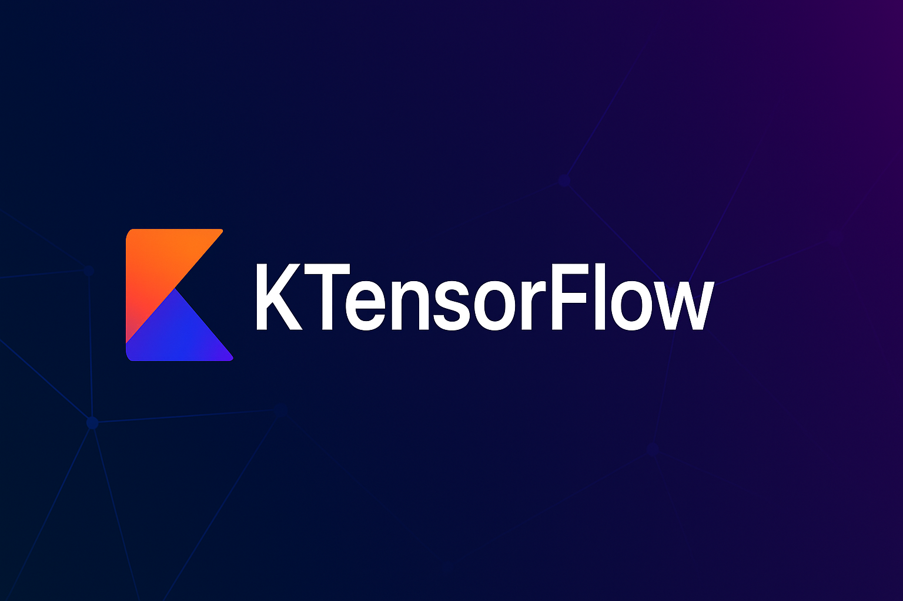

[](https://repo1.maven.org/maven2/dev/kursor/ktensorflow/ktensorflow-core/)
[](http://www.apache.org/licenses/LICENSE-2.0)

# KTensorFlow 2.0
KTensorFlow is a Kotlin Multiplatform library designed to run LiteRT (TensorFlow Lite) neural network models from common code. It abstracts platform-specific implementation details, making it easier to load models and run inference across Android and iOS.

**Version 2.0** brings massive architectural improvements, including a dedicated **Computer Vision** module, **Coroutines & Flow** support with built-in Backpressure, and **Zero-Copy Tensor Views**.

## Table of Contents

- [Requirements](#requirements)
- [Installation](#installation)
- [Usage](#usage)
  - [Model loading](#load-the-model)
    - [Compose resources extensions](#compose-resources-extensions)
    - [Moko resources extensions](#moko-resources-extensions)
  - [Inference & Data Transformation](#inference--data-transformation)
    - [Zero-Copy Tensor Views](#zero-copy-tensor-views)
  - [Computer Vision (New)](#computer-vision-vision-module)
  - [Coroutines & Video Streams (New)](#coroutines--video-streams-coroutines-module)
  - [Pipelines (Preprocessing & Postprocessing)](#pipelines)
  - [Hardware acceleration](#hardware-acceleration)
  - [Providing platform-specific options](#providing-platform-specific-options)
  - [Writing custom delegates](#writing-custom-delegates)

## Requirements

| | Minimum |
|---|---|
| Kotlin | 2.4.20 |
| Android | API 24, apps compiled with `compileSdk` 34 or newer |
| iOS | 15.0 |

iOS projects are linked through CocoaPods (see [Installation](#installation)). The iOS minimum comes from Kotlin/Native, which builds the library for iOS 15: an app with a lower deployment target gets linker warnings and may crash on older iOS.

## Installation
First add dependencies:

```kotlin
dependencies {
  val ktfVersion = "2.0"

  // Core module, contains Interpreter and model loading functions
  implementation("dev.kursor.ktensorflow:ktensorflow-core:$ktfVersion")

  // Tensors module: allows easy data transformation and shape manipulation
  implementation("dev.kursor.ktensorflow:ktensorflow-tensor:$ktfVersion")

  // Vision module (NEW): Cross-platform Image, Bounding Boxes, NMS, and Resizing
  implementation("dev.kursor.ktensorflow:ktensorflow-vision:$ktfVersion")

  // Coroutines module (NEW): Flow processing, async inference, and Frame Dropping
  implementation("dev.kursor.ktensorflow:ktensorflow-coroutines:$ktfVersion")

  // Pipeline module: utils to create declarative ML pipelines
  implementation("dev.kursor.ktensorflow:ktensorflow-pipeline:$ktfVersion")

  // GPU & NPU delegates
  implementation("dev.kursor.ktensorflow:ktensorflow-gpu:$ktfVersion")
  implementation("dev.kursor.ktensorflow:ktensorflow-npu:$ktfVersion")

  // Compose Multiplatform resources support
  implementation("dev.kursor.ktensorflow:ktensorflow-compose:$ktfVersion")
  
  // Moko resources support (optional)
  implementation("dev.kursor.ktensorflow:ktensorflow-moko:$ktfVersion")
}
```

To link TensorFlow Lite binaries to iOS you need to add Linking plugin
```kotlin
plugins {
  id("dev.kursor.ktensorflow.link") version "2.0"
}
```
**Currently, this library only supports projects that are being linked to iOS app via CocoaPods**

## Usage
### Load the model
First, you need to create `ModelDesc`, that would provide model to the library.
There are extensions for Compose and Moko Resources in `ktensorflow-compose` and `ktensorflow-moko` modules.

#### Compose resources extensions
Module `ktensorflow-compose` contains useful extension function to create `ModelDesc` from [compose-resources](https://github.com/JetBrains/compose-multiplatform)
* `ModelDesc.ComposeUri(uri: String)` to load model with `Res.getUri(<filePath>)`

```kotlin
// Common code
val modelDesc = ModelDesc.ComposeUri(Res.getUri("files/model.tflite"))
```

#### Moko resources extensions
Module `ktensorflow-moko` contains useful extension functions to create a `ModelDesc` from [moko-resources](https://github.com/icerockdev/moko-resources).
* `ModelDesc.FileResource(resource: FileResource)` to load a model from moko's `FileResource`
* `ModelDesc.AssetResource(resource: AssetResource)` to load a model from moko's `AssetResource`

### Inference & Data Transformation
To run the inference, create `Interpreter`:
```kotlin
val interpreter = Interpreter(
  modelDesc = modelDesc,
  options = InterpreterOptions()
)
```

The `Tensor` class provides a multidimensional array representation that supports arithmetic operations, `forEach`, `map`, `min`, `max`, `argmin`, `argmax`, etc.

```kotlin
val input = Tensor<Float>(Array(28) { FloatArray(28) { Random.nextFloat() } })
val output = Tensor<Float>(shape = TensorShape(10), dataType = TensorDataType.Float32)

interpreter.run(input, output) // Single input/output syntax sugar
val result = output.argmax()[0]
```

`setFlat` and `getFlat` are generic, so every value passes through them as an object. That is fine for a few values, but to fill a tensor element by element, for example from your own preprocessing, use `setFlatUnboxed` on a `PhysicalTensor`: it writes straight into the tensor's bytes and is several times faster.
```kotlin
val input = Tensor(TensorDataType.Float32, TensorShape(1, 28, 28))
for (i in 0 until input.shape.flatSize) {
  input.setFlatUnboxed(i, pixels[i] / 255f)
}
```

#### Zero-Copy Tensor Views
In version 2.0, shape manipulation functions do **not** copy memory. `reshape()`, `flatten()`, `transpose()`, `permuted()`, `squeeze()`, and `slice()` return a `TensorView`, which mathematically maps coordinates to the original memory block (`PhysicalTensor`) with zero overhead.

```kotlin
val tensor: Tensor<Float> = Tensor(Array(28) { FloatArray(28) { Random.nextFloat() } })

// Zero-copy transformations!
val transposedView = tensor.transpose()
val slicedView = tensor.slice(0..13, 0..27)

// Extract data
val argmax: IntArray = tensor.argmax()
val array = tensor.toPhysical().toArray<Array<FloatArray>>()
```

### Computer Vision (Vision Module)
The new `ktensorflow-vision` module provides cross-platform Computer Vision primitives, hiding the differences between Android's `Bitmap` and iOS's `CGImage`/`CVPixelBuffer`.

#### Obtaining an Image
```kotlin
// Android: wrap a Bitmap (ARGB_8888)
val image: Image = AndroidImage(bitmap, PixelFormat.ARGB)

// iOS: copy a camera frame or a CoreGraphics image; the caller keeps ownership of the source
val frame: Image = Image(CMSampleBufferGetImageBuffer(sampleBuffer)!!)
val picture: Image = Image(uiImage.CGImage!!)
```
Camera frames arrive in the sensor orientation on both platforms, so `rotate` them to make them upright.

#### Images & Tensorization
```kotlin
val originalImage: Image = // ... obtain from Camera or File

// Resize maintaining aspect ratio and adding padding (Letterbox)
val paddedImage = originalImage.resizeWithPad(320, 320)

// Convert Image directly to Tensor (normalized to [-1.0, 1.0])
val tensor = paddedImage.tensorizeFloat(
    layout = ImageTensorLayout.NHWC,
    normalization = Normalization.MinusOneToOne
)
```

#### Bounding Boxes & NMS
KTensorFlow makes it extremely easy to map Neural Network coordinates back to your UI:

```kotlin
val detections = mutableListOf<DetectedObject>()

for (i in 0 until count) {
    // 1. Parse Normalized, YOLO or COCO formats
    // 2. PadInfo automatically removes letterbox padding and scales coordinates back to the original Camera Frame!
    val rect = Rect.fromNormalized(
        ymin, xmin, ymax, xmax,
        padInfo = paddedImage.info 
    )
    detections.add(DetectedObject(label, score, rect))
}

// Built-in Non-Maximum Suppression (NMS) to filter overlapping boxes!
val finalDetections = detections.nms(
    iouThreshold = 0.5f,
    scoreThreshold = 0.3f,
    scoreSelector = { it.confidence },
    boxSelector = { it.rect },
    classSelector = { it.label } // Multi-class NMS
)
```
To draw the `Rect` on the screen in Compose, you can scale it easily using `rect.scaleForContainer(originalWidth, originalHeight, containerWidth, containerHeight, isCrop = true)`.

### Coroutines & Video Streams (Coroutines Module)
Running inference on the UI thread causes ANRs. The `ktensorflow-coroutines` module provides safety and flow stream operators.

#### Async Inference
```kotlin
// Creates the interpreter on the module's inference thread. Needed for the GPU delegate on Android
// devices without OpenCL: its OpenGL backend must run inference on the thread that created it
val interpreter = SuspendInterpreter(
  modelDesc,
  InterpreterOptions(numThreads = 4, useXNNPACK = true, delegates = listOf(gpu))
)

// Runs off the calling thread, on that same inference thread; concurrent calls queue instead of
// blocking threads
val result = pipeline.runSuspend(image)
```

By default every function of the module shares one `InferenceDispatcher`, so inference runs one call at a time across the whole app. To run several models in parallel, give each interpreter its own `InferenceDispatcher` and pass it both when creating the interpreter and when running it. On Android it runs on a single thread of its own, which is also what the GPU delegate needs on devices without OpenCL:
```kotlin
val detectorDispatcher = InferenceDispatcher()
val detector = SuspendInterpreter(detectorModel, detectorOptions, detectorDispatcher)

// Runs in parallel with inference on other dispatchers
val boxes = detectionPipeline.runSuspend(tuple(frame), detectorDispatcher)

// When the interpreter is no longer needed: on Android the dispatcher owns a thread. Calls with a
// closed dispatcher throw IllegalStateException
detector.close()
detectorDispatcher.close()
```

A dispatcher of its own also matters while a model loads. `SuspendInterpreter` loads the model, and compiles the GPU delegate, on the dispatcher it is given, which can take seconds; on the shared dispatcher all other inference waits meanwhile, so a camera pipeline freezes while another screen loads its model. Load a model that starts next to running ones on its own `InferenceDispatcher`.

#### Real-time Video Stream Processing (Backpressure / Frame Dropping)
If your camera produces 60 FPS, but your ML model can only process 15 FPS, your app will run out of memory (OOM) because unprocessed frames accumulate.

Use **`processFlowDropping`** to automatically discard camera frames when the ML Pipeline is busy. It takes full ownership of the `AutoCloseable` memory, preventing memory leaks: every frame it receives is closed exactly once - a dropped frame right away, a processed frame as soon as the pipeline has finished with it (even if it failed or the collection was cancelled).

> **Note:** because the flow closes each frame after the pipeline runs, the pipeline must not keep a reference to its input frame. Derive everything the output needs (tensors, detections, coordinates) inside the pipeline.

```kotlin
// Your camera frames flow
val frameFlow: Flow<Image> = // ...

// Preprocess inside the pipeline: a frame dropped while the model is busy is never resized
val detection = Pipeline(Stage<Image, List<DetectedObject>> { frame ->
    // The flow closes the frame itself; the resized copy is closed here
    frame.resizeWithPad(300, 300, closeOriginal = false).use { paddedImage ->
        mapToDomainModel(detectionPipeline.run(tuple(paddedImage)), paddedImage.info)
    }
})

val detectionResultsFlow = detection
    // Automatic Frame Dropping! Zero latency, zero OOMs.
    .processFlowDropping(frameFlow)
```

### Pipelines
You can create declarative pipelines to encapsulate pre/post-processing. KTensorFlow 2.0 automatically extracts SignatureDefs from your `.tflite` model, so you can use human-readable signature names instead of hardcoded output indices!

```kotlin
val detectionPipeline = Pipeline
  .input(Stage<PaddedImage>().then { it.tensorizeFloat() })
  .inference(interpreter)
  .output(
    name = "detection_boxes", // Fetches correct index from ModelMeta dynamically!
    dataType = TensorDataType.Float32,
    shape = TensorShape(1, 100, 4),
    postprocessing = Stage<Tensor<Float>>().then { toBoundingBoxes(it) }
  )
  .output(
    name = "detection_classes",
    dataType = TensorDataType.Float32,
    shape = TensorShape(1, 100),
    postprocessing = Stage<Tensor<Float>>().then { toClassIds(it) }
  )
  .build()

// Run pipeline
// Билдер строит Pipeline<Tuple.One<PaddedImage>, ...>, поэтому вход оборачивается в tuple()
val (boxes, classes) = detectionPipeline.run(tuple(paddedImage))
```

### Hardware acceleration
Hardware acceleration is provided by delegates.
There are built-in Delegates to run inference on GPU and NPU in modules `ktensorflow-gpu` and `ktensorflow-npu`.

Delegates can be provided to interpreter using `InterpreterOptions`
```kotlin
val gpu = GpuDelegate()
val npu = NpuDelegate()
val interpreter = Interpreter(
  modelDesc,
  InterpreterOptions(
    numThreads = 4,
    useXNNPACK = true,
    delegates = listOf(gpu, npu)
  )
)

// ...

// Delegates hold native resources: close them after every interpreter that uses them
interpreter.close()
gpu.close()
npu.close()
```

Every available delegate is applied, in list order: each one takes the operations it supports from what the previous ones left, and the rest runs on the CPU. Unavailable delegates are skipped.

A delegate that is available on the device can still fail to apply to a particular model, for example when an NNAPI driver cannot compile part of the graph or the GPU cannot create its context. TensorFlow Lite does not fall back to the CPU in this case: creating the interpreter fails with `TensorFlowException`. Whether a delegate applies is known only on the device, so when you use delegates, keep a CPU fallback:
```kotlin
val interpreter = try {
  Interpreter(modelDesc, InterpreterOptions(numThreads = 4, useXNNPACK = true, delegates = listOf(gpu)))
} catch (e: TensorFlowException) {
  // The model runs on the CPU instead
  Interpreter(modelDesc, InterpreterOptions(numThreads = 4, useXNNPACK = true, delegates = emptyList()))
}
```

### Providing platform-specific options
If you need to provide platform specific option to the `Interpreter` or `GpuDelegate` you can use platform-specific builder functions:

Android:
```kotlin
val interpreterOptions = InterpreterOptions { // this: Interpreter.Options
  setUseNNAPI(true)
}

val gpuDelegateOptions = GpuDelegateOptions { // this: GpuDelegateFactory.Options
  setPrecisionLossAllowed(true)
}

val npuDelegateOptions = NpuDelegateOptions { // this: NpuDelegate.Options
  setMaxNumberOfDelegatedPartitions(maxDelegatedPartitions)
}
```

iOS:
```kotlin
val interpreterOptions = InterpreterOptions(delegates = emptyList()) { // this: TFLInterpreterOptions
  setUseXNNPACK(true)
}

val gpuDelegateOptions = GpuDelegateOptions { // this: TFLMetalDelegateOptions
  setWaitType(TFLMetalDelegateThreadWaitType.TFLMetalDelegateThreadWaitTypeActive)
}

val npuDelegateOptions = NpuDelegateOptions { // this: TFLCoreMLDelegateOptions
  setMaxDelegatedPartitions(maxDelegatedPartitions.toULong())
}
```

### Writing custom delegates
If you need to use a custom delegate that is not yet supported by the library, create a class that would implement `Delegate` interface.

## License
```
Copyright 2026 Sergey Kurochkin

Licensed under the Apache License, Version 2.0 (the "License");
you may not use this file except in compliance with the License.
You may obtain a copy of the License at

    http://www.apache.org/licenses/LICENSE-2.0

Unless required by applicable law or agreed to in writing, software
distributed under the License is distributed on an "AS IS" BASIS,
WITHOUT WARRANTIES OR CONDITIONS OF ANY KIND, either express or implied.
See the License for the specific language governing permissions and
limitations under the License.
```